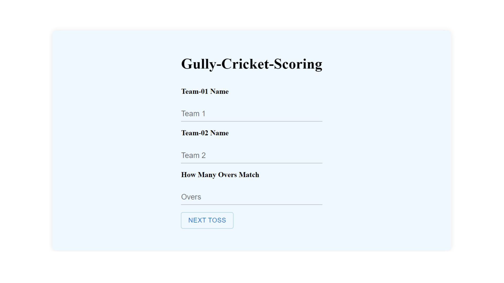
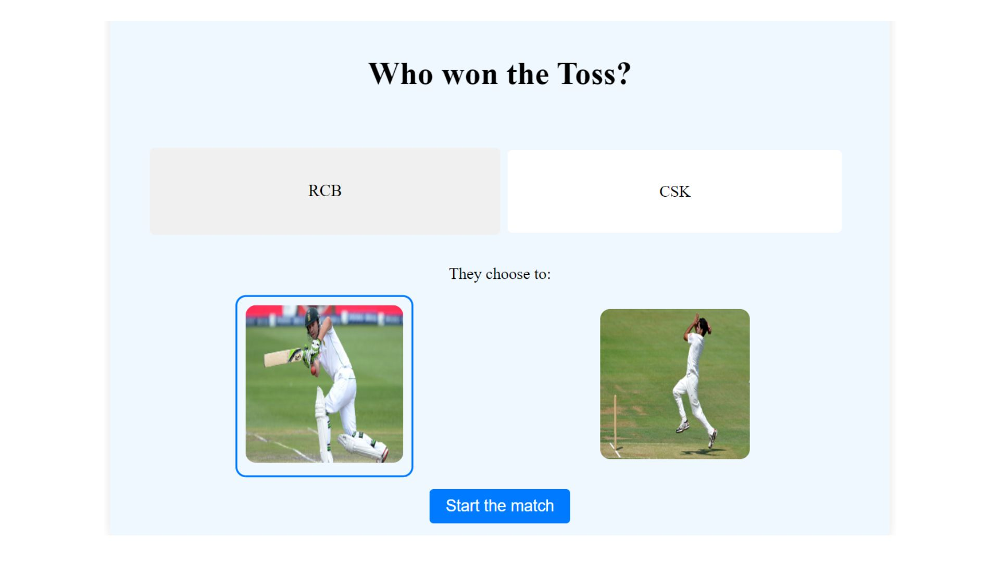
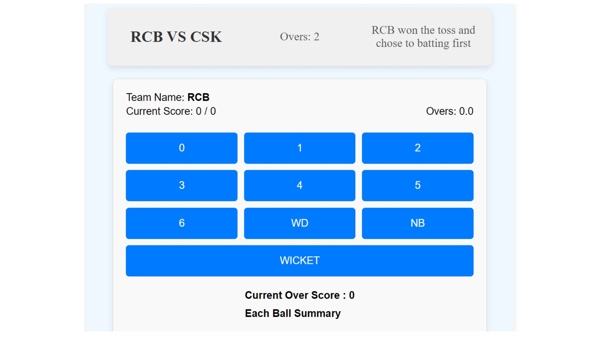
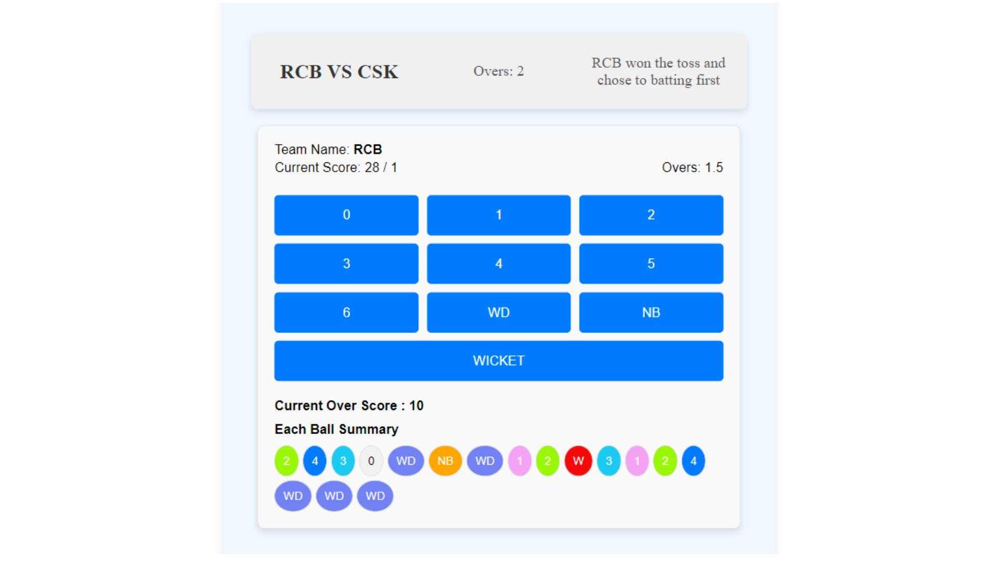
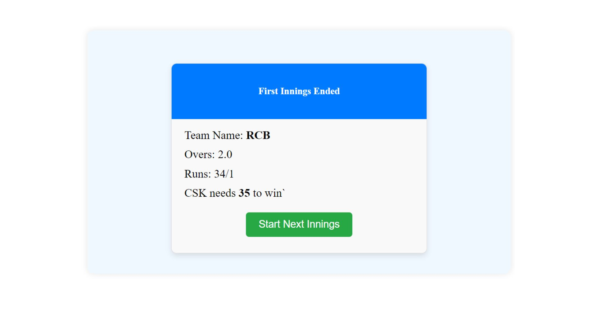

# Cricket Scoreboard

This is a dynamic and responsive Cricket Scoreboard application built using React.js and Redux for state management. The application allows users to input team names, set overs, select the toss winner and choice, and view a real-time scoring board with runs, overs, ball descriptions, and match results.

## Features

- **User Input**: Users can input team names, set the number of overs, and choose the toss winner and their choice to bat or bowl.
- **Dynamic Scoring Board**: Displays real-time runs, overs, ball descriptions, and match results.
- **Responsive UI**: Ensures a seamless user experience on various devices.

## SNAPSHOTS






## Installation
1. Clone the repository:
   ```bash
   git clone https://github.com/yourusername/cricket-scoreboard.git
   ```
2. Navigate to the project directory:
```bash
Copy code
cd cricket-scoreboard
```
3. Install dependencies:
```bash
Copy code
npm install
```
4.Start the development server:
```bash
npm start
```

